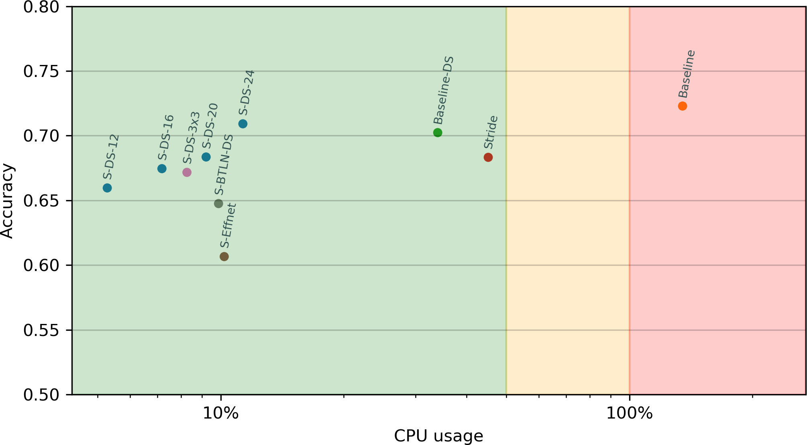
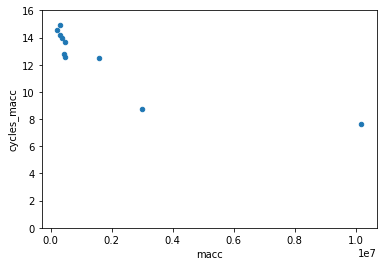

---
title: Environmental Sound Classification on Microcontrollers using Convolutional Neural Networks
author: Jon Nordby <jononor@gmail.com>
date: June 26, 2019
margin: 0
css: style.css
---

# Introduction

## Me

Internet of Things specialist

- B.Eng in **Electronics**
- 9 years as **Software** developer. **Embedded** + **Web**
- M. Sc in **Data** Science

## Problem statement

> Can we classify environmental sounds directly
> on a wireless and battery-operated noise sensor?

## Noise Pollution

`TODO: describe impacts`

## Environmental Sound Classification

::: notes

Widely researched. 1000 hits on Google Scholar

:::

## Wireless Sensor Networks

- Wide and dense coverage needed -> Sensors need to be low-cost
- Opportunity: Wireless simplifies installation, reduces costs
- Challenge: Power consumption

::: notes
No network cabling, no power cabling
No site infrastructure needed
Less invasive
Fewer approvals needed
Temporary installs feasible
Mobile sensors possible

Electrician is 750 NOK/hour
:::

## Data Transmission

{width=100%}

## Microcontroller 

STM32L476

{width=100%}

::: notes

ARM Cortex M4F
Hardware floating-point unit (FPU)
DSP SIMD instructions
80 MHz CPU clock 
1024 kB of program memory (Flash)
128 kB of RAM.

:::

## Model constraints

`TODO: list constraints`

::: notes

- Training and inference are independent implementations. Have to be in sync

:::

# Existing work

## Audio Classification state-of-the-art

- Convolutional Neural Networks dominate
- Mel-spectrogram input standard
- End2end models (raw audio input) research very active

## Mel-spectrogram

{width=100%}

## Existing Urbansound methods

{width=100%}

::: notes

Assuming no overlap. Most models use very high overlap, 100X higher compute

:::

## Depthwise-separable convolution

MobileNet, "Hello Edge"

{width=100%}
 
## Spatially-separable convolution

EffNet, LD-CNN

{width=100%}

# Materials

## Overview

- Dataset: Urbansound8k
- Hardware: STM32L476 SensorTile
- Inference framework: X-CUBE-AI
- Models: CNN, 11 variations
- Training: Keras+Tensorflow

## Urbansound8k 

{width=100%}

## X-CUBE-AI

::: notes

* First public version came out in December 2018
* Version 3.4.0
* Not reported in use yet on Google Scholar
* Ahead of TensorFlow Lite for Microcontrollers
* Means did not need to implement myself in `emlearn`
* Decisive for choosing the STM32 hardware platform 

:::

## Models

<!--
Based on SB-CNN (Salamon+Bello, 2016)
-->

{height=100%}

## Convolution options

`TODO: image of different convolutions blocks`

## All models

::: notes

* Baseline is outside requirements
* Rest fits theoretical constraints
* Sometimes had to reduce number of base filters to 22 to fit in RAM

:::

# Methods

- Classification problem
- 10-fold cross-validation
- 

## Preprocessing

{width=100%}

## Training

- 10 models x 10 folds = 100 training jobs
- 3 jobs in parallel, 36 hours total

## Evaluation

For each fold of each model

- Select best model based on validation accuracy
- Calculate accuracy on test set
- Calculated accuracy for foreground,background 

For each model

- Measure CPU time on device

# Results & Discussion

## Model comparison

{width=100%}

::: notes

- Baseline relative to SB-CNN and LD-CNN is down from 79% to 73%
Expected because poorer input representation.
Fewer 

:::

## Performance vs compute

{width=100%}

:::

- Performance of Strided-DS-24 similar to Baseline despite 12x the CPU use
- Suprising: Stride alone worse than Strided-DS-24
- Bottleneck and EffNet performed poorly
- Practical speedup not linear with MACC

:::

## Spectrogram processing

* Model: Stride-DS-24 (60 mels, 1024 FFT, 22 kHz): *81 milliseconds*

* Preprocessing: mel-spectrogram (30 mels, 1024 FFT, 16 kHz): *60 milliseconds*

::: notes

* Bottleneck for reducing CPU time / power consumption
* Opportunity for end2end models.
* Does not seem to be there yet? Not explicitly considered in literature
* Especially interesting with CNN co-processors

:::

## Confusion matrix

{width=100%}

## Conclusions

`TODO: list conclusions`

# Demo

## Demo video

`TODO: add inline or link`

# Next steps

## Improving performance

Model quantization

- *CMSIS-NN* 8bit SIMD -> 4x speedup

Stronger training process 

- Data Augmentation. *Mixup*, *SpecAugment*
- Transfer Learning on more data. *AudioSet* 

## Practical challenges

- Real-life performance evaluations. Out-of-domain samples
- Reducing power consumption. Adaptive sampling
- Efficient training data collection in WSN. Active Learning? 

## Soundsensing

Sensor Systems for Noise Monitoring

- Supported by Norwegian Research Council
- Pilot project with Oslo Kommune
- Accepted to incubator at StartupLab

# Summary

## Summary

- Noise pollution is a growing problem
- Wireless Sensor Networks used to quantify
- On-sensor classification desirable for power/cost and privacy
- Thorough literature review on efficient CNN and ESC
- Methods. Follows established practices for ESC
- Results. Best reported for Urbansound8k on a microcontroller
- Demonstrated working in a practical test
- Basis for a new company from NMBU Data Science

# Questions?

`TODO: add project image`

# BONUS

## Grouped classification

{}

Foreground-only

## Adding Unknown class

{}

::: notes

Idea: If confidence of model is low, consider it as "unknown"

* Left: Histogram of correct/incorrect predictions
* Right: Precision/recall curves
* Precision improves at expense of recall
* 90%+ precision possible at 40% recall

Usefulness:

* Avoids making decisions on poor grounds
* "Unknown" samples good candidates for labeling->dataset. Active Learning 
* Low recall not a problem? Data is abundant, 15 samples a 4 seconds per minute per sensor

:::

## CPU efficiency

{}

::: notes

:::

## What could be done better

- Hyperparameter tuning per model
- Run evaluation also on unmodified SB-CNN,
verify training process
- Fix random seeds,
ensure exact reproducability
- Request review feedback sooner and more often,
catch mistakes earlier

## What worked well

- Automated pipeline for result processing.
Easy updating of new results into report
- Using official X-CUBE-AI instead of own implementation,
or using less-ready inference library
- Automated checking of device constraints,
eased finding suitable model parameters

<!--
## Publishing

- Planning a paper submission to journal/conference
- Have contacted Salamon, Bello
-->

## Working method

- Independent study Audio Classification. DAT390
- DCASE2018 conference
- Literature review. Summarized in report
- Experiments phase. Tried large amount of different classifiers

# MISC

## 2D-convolution

{width=100%}

## Downsampling using max-pooling

{width=100%}

## Downsampling using strided convolution

{width=100%}

## Bug: Integer truncation

## Dropout location

